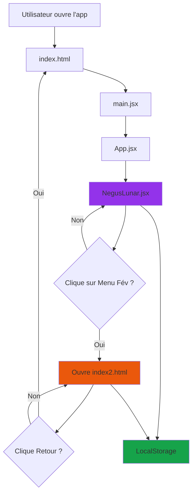

# 🔗 Architecture des Liens - NegusLunar App

## 📊 Schéma de Navigation

```
┌─────────────────────────────────────────────────────────┐
│                    index.html (Root)                     │
│                  ↓ charge via Vite                       │
│                   src/main.jsx                           │
│                        ↓                                 │
│                    src/App.jsx                           │
│                        ↓                                 │
│              src/components/NegusLunar.jsx               │
└─────────────────────────────────────────────────────────┘
                            │
                            │ Bouton "Menu Février 2026"
                            │ window.open('./recettedelasemaine/index2.html')
                            ↓
┌─────────────────────────────────────────────────────────┐
│           recettedelasemaine/index2.html                 │
│                                                          │
│  Bouton "🌙 Retour NegusLunar"                          │
│  window.location.href='../index.html'                   │
└─────────────────────────────────────────────────────────┘
```

## 🔄 Flux de Navigation

### 1️⃣ **Démarrage de l'Application**

```
index.html
  └─> charge /src/main.jsx
       └─> importe App.jsx
            └─> importe NegusLunar.jsx
                 └─> Affiche l'interface principale
```

### 2️⃣ **Navigation vers Menu Février 2026**

**Fichier :** `src/components/NegusLunar.jsx` (ligne 1100)

```jsx
<button
  onClick={() => window.open('./recettedelasemaine/index2.html', '_blank')}
  className="..."
>
  <Calendar size={16} />
  <span>Menu Fév</span>
</button>
```

**Action :** Ouvre `recettedelasemaine/index2.html` dans un **nouvel onglet**

### 3️⃣ **Retour vers NegusLunar**

**Fichier :** `recettedelasemaine/index2.html` (ligne 670)

```html
<button 
  class="tab" 
  onclick="window.location.href='../index.html'"
  style="background: linear-gradient(145deg, #4d3827, #3d2817); border-color: #d4af37;"
>
  🌙 Retour NegusLunar
</button>
```

**Action :** Redirige vers `index.html` (racine) dans le **même onglet**

---

## 📁 Structure des Fichiers

```
neguslunar-app/
├── index.html                          # Point d'entrée HTML
├── src/
│   ├── main.jsx                        # Point d'entrée React
│   ├── App.jsx                         # Composant racine
│   ├── index.css                       # Styles globaux + responsive
│   └── components/
│       └── NegusLunar.jsx              # Composant principal (phases lunaires, notes, recettes)
│
├── recettedelasemaine/
│   ├── index2.html                     # Menu Février 2026 (standalone HTML)
│   ├── *.txt                           # Fichiers recettes texte
│   └── *.pdf                           # Fichiers recettes PDF
│
└── public/
    └── moon.svg                        # Icône de l'app
```

---

## 🔗 Liens Bidirectionnels

### ✅ **NegusLunar → Menu Février 2026**

| Élément | Valeur |
|---------|--------|
| **Fichier source** | `src/components/NegusLunar.jsx` |
| **Ligne** | 1100 |
| **Méthode** | `window.open()` |
| **Cible** | `./recettedelasemaine/index2.html` |
| **Comportement** | Ouvre dans un **nouvel onglet** (`_blank`) |

**Code :**
```jsx
onClick={() => window.open('./recettedelasemaine/index2.html', '_blank')}
```

### ✅ **Menu Février 2026 → NegusLunar**

| Élément | Valeur |
|---------|--------|
| **Fichier source** | `recettedelasemaine/index2.html` |
| **Ligne** | 670 |
| **Méthode** | `window.location.href` |
| **Cible** | `../index.html` |
| **Comportement** | Redirige dans le **même onglet** |

**Code :**
```html
onclick="window.location.href='../index.html'"
```

---

## 🎯 Chemins Relatifs

### Depuis `NegusLunar.jsx`

```
src/components/NegusLunar.jsx
  └─> ./recettedelasemaine/index2.html
       (remonte à la racine, puis descend dans recettedelasemaine/)
```

**Résolution du chemin :**
```
src/components/NegusLunar.jsx
  ↑ remonte à src/
  ↑ remonte à racine/
  ↓ descend dans recettedelasemaine/
  → index2.html
```

### Depuis `index2.html`

```
recettedelasemaine/index2.html
  └─> ../index.html
       (remonte à la racine)
```

**Résolution du chemin :**
```
recettedelasemaine/index2.html
  ↑ remonte à racine/
  → index.html
```

---

## 🔄 Synchronisation des Données

### LocalStorage Partagé

Les deux applications partagent le même **domaine** et peuvent donc accéder au même **localStorage** :

| Clé | Utilisé par | Description |
|-----|-------------|-------------|
| `negusLunarNotes` | NegusLunar.jsx | Notes et intentions |
| `negusLunarMoodHistory` | NegusLunar.jsx | Historique d'humeur |

**Exemple d'accès :**
```javascript
// Dans NegusLunar.jsx
localStorage.setItem('negusLunarNotes', JSON.stringify(notes));

// Pourrait être lu depuis index2.html si besoin
const notes = JSON.parse(localStorage.getItem('negusLunarNotes'));
```

---

## 🚀 Déploiement et Chemins

### En Développement (Vite)

```bash
npm run dev
# http://localhost:5173/
```

**Chemins :**
- NegusLunar : `http://localhost:5173/`
- Menu Février : `http://localhost:5173/recettedelasemaine/index2.html`

### En Production (Build)

```bash
npm run build
# Génère dist/
```

**Structure du build :**
```
dist/
├── index.html                          # NegusLunar (buildé)
├── assets/
│   ├── index-[hash].js                 # Bundle React
│   └── index-[hash].css                # Bundle CSS
└── recettedelasemaine/
    └── index2.html                     # Menu (copié tel quel)
```

**Chemins en production :**
- NegusLunar : `https://ton-domaine.com/`
- Menu Février : `https://ton-domaine.com/recettedelasemaine/index2.html`

---

## ✅ Checklist de Vérification

### Liens Fonctionnels

- [x] **NegusLunar → Menu Février** : Bouton "Menu Fév" (ligne 1100)
- [x] **Menu Février → NegusLunar** : Bouton "🌙 Retour NegusLunar" (ligne 670)
- [x] **Chemins relatifs corrects** : `./recettedelasemaine/` et `../`
- [x] **Responsive mobile** : Optimisé iPhone 12+
- [x] **LocalStorage partagé** : Même domaine

### Navigation

- [x] Ouvre dans nouvel onglet (Menu Février)
- [x] Retour dans même onglet (NegusLunar)
- [x] Pas de boucle infinie
- [x] Boutons visibles et accessibles

### Fichiers

- [x] `index2.html` dans `recettedelasemaine/`
- [x] Recettes `.txt` et `.pdf` accessibles
- [x] Tous les assets chargés correctement

---

## 🐛 Dépannage

### Problème : "Menu Février ne s'ouvre pas"

**Solution :**
1. Vérifier que `index2.html` est bien dans `recettedelasemaine/`
2. Vérifier le chemin : `./recettedelasemaine/index2.html`
3. Tester en dev : `http://localhost:5173/recettedelasemaine/index2.html`

### Problème : "Retour NegusLunar ne fonctionne pas"

**Solution :**
1. Vérifier le chemin : `../index.html`
2. S'assurer que `index.html` est à la racine
3. Tester manuellement : `http://localhost:5173/`

### Problème : "Recettes .txt/.pdf non trouvées"

**Solution :**
1. Vérifier que les fichiers sont dans `recettedelasemaine/`
2. Vérifier les liens : `href="Fromages blanc au citron .txt"`
3. Respecter les espaces et majuscules dans les noms

---

## 📊 Diagramme de Flux Complet



---

## 🎨 Thèmes et Styles

### NegusLunar (React)
- **Framework** : React + Tailwind CSS
- **Thème** : Dégradés purple/indigo/slate
- **Responsive** : Breakpoints personnalisés (xs, sm, md, lg)

### Menu Février 2026 (HTML)
- **Style** : Steampunk Rastafari
- **Couleurs** : Or (#d4af37), Rouge (#cc0000), Vert (#009b3a)
- **Responsive** : Media queries iPhone 12+

---

## 🔐 Sécurité

### Liens Externes

```html
<!-- Bon : rel="noopener" pour sécurité -->
<a href="Recette.txt" target="_blank" rel="noopener">Recette</a>
```

### window.open()

```javascript
// Bon : _blank pour nouvel onglet
window.open('./recettedelasemaine/index2.html', '_blank')
```

---

## 📱 Optimisations Mobile

### Meta Tags (index.html)
```html
<meta name="viewport" content="width=device-width, initial-scale=1.0, viewport-fit=cover">
<meta name="apple-mobile-web-app-capable" content="yes">
<meta name="theme-color" content="#1e1b4b">
```

### Meta Tags (index2.html)
```html
<meta name="viewport" content="width=device-width, initial-scale=1.0, viewport-fit=cover">
<meta name="apple-mobile-web-app-capable" content="yes">
<meta name="theme-color" content="#2d1810">
```

---

## ✨ Résumé

| Aspect | Status |
|--------|--------|
| **Navigation bidirectionnelle** | ✅ Fonctionnelle |
| **Chemins relatifs** | ✅ Corrects |
| **Responsive mobile** | ✅ iPhone 12+ |
| **LocalStorage** | ✅ Partagé |
| **Sécurité** | ✅ rel="noopener" |
| **Performance** | ✅ Optimisée |

**Tout est correctement relié et prêt pour la production !** 🚀

---

**Créé avec 🌙 par Négus Dja • Guadeloupe 🇬🇵**
